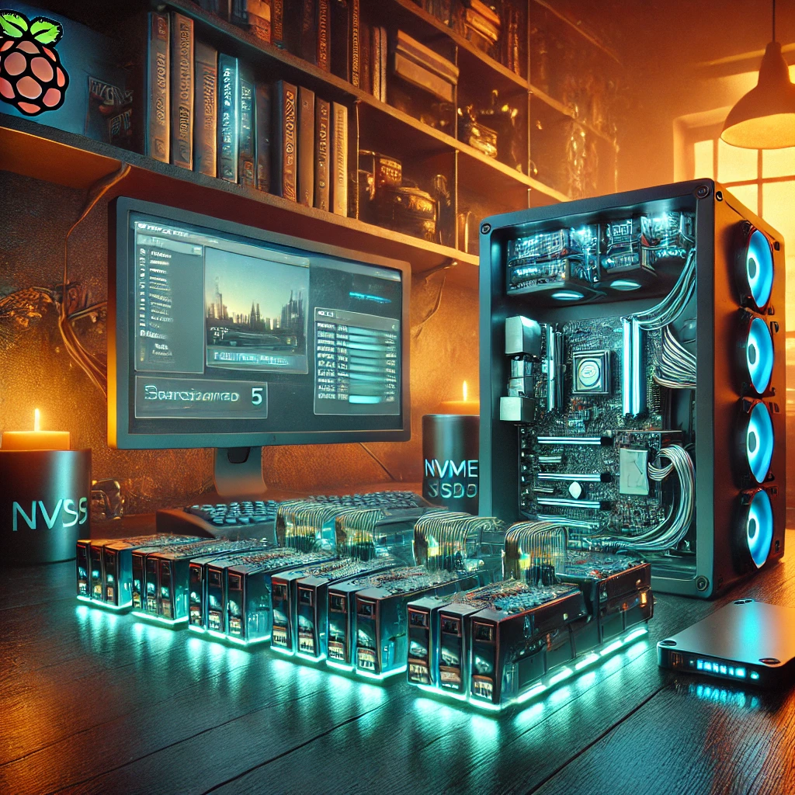

# **Building a Raspberry Pi 5 NAS with NVMe Storage**



Setting up a **NAS (Network Attached Storage)** on a Raspberry Pi 5 with **NVMe SSDs** provides high-speed storage accessible across your network. Follow this step-by-step guide to get your **Raspberry Pi NAS** up and running.

## **🛠️ Step 1: Prepare Your Hardware**

### **✅ What You'll Need**

- Raspberry Pi 5
- NVMe Base Duo (Pimoroni)
- One or two NVMe SSDs
- USB-C power supply (**5V 5A recommended**)
- Cooling solution (optional, but NVMe SSDs can get hot)
- Ethernet cable for best performance

---

## **📥 Step 2: Install Raspberry Pi OS**

1. **Download Raspberry Pi OS (Lite recommended):**

   - Go to [Raspberry Pi Imager](https://www.raspberrypi.com/software/).
   - Choose **Raspberry Pi OS Lite (64-bit)**.
   - Flash it to a **16GB+ microSD card**.
   - Enable **SSH** in the "Advanced Options" before flashing.
   - Insert the microSD card into the Raspberry Pi and power it on.

2. **Update the OS & Firmware:**
   ```bash
   sudo apt update && sudo apt full-upgrade -y
   sudo rpi-eeprom-update -a
   sudo reboot
   ```

---

## **💾 Step 3: Set Up NVMe Drives**

### **🔍 Check if the drives are detected**

```bash
lsblk
```

You should see **nvme0n1** and **nvme1n1**.

### **🛠️ Format the SSDs**

If the drives are unformatted:

```bash
sudo fdisk /dev/nvme0n1
```

- Type `n` (new partition)
- Accept defaults
- Type `w` (write changes)

Format as **EXT4**:

```bash
sudo mkfs.ext4 /dev/nvme0n1p1
```

Create a mount point:

```bash
sudo mkdir /mnt/nas
```

Mount the drive:

```bash
sudo mount /dev/nvme0n1p1 /mnt/nas
```

Make it auto-mount on boot:

```bash
echo "/dev/nvme0n1p1 /mnt/nas ext4 defaults 0 0" | sudo tee -a /etc/fstab
```

(Repeat for **nvme1n1** if using a second SSD.)

---

## **📂 Step 4: Install & Configure Samba (File Sharing)**

1. Install Samba:

   ```bash
   sudo apt install samba -y
   ```

2. Edit Samba config:

   ```bash
   sudo nano /etc/samba/smb.conf
   ```

   Add this at the bottom:

   ```
   [NAS]
   comment = Raspberry Pi NAS
   path = /mnt/nas
   browseable = yes
   writable = yes
   read only = no
   guest ok = no
   create mask = 0777
   directory mask = 0777
   force user = pi
   ```

3. Set a Samba password for the `pi` user:

   ```bash
   sudo smbpasswd -a pi
   ```

4. Restart Samba:
   ```bash
   sudo systemctl restart smbd
   ```

---

## **💻 Step 5: Access Your NAS from Windows & macOS**

### **🔹 From Windows:**

1. Open **File Explorer**.
2. Type `\\raspberrypi\NAS` in the address bar.
3. Enter the **username: pi** and **password: Taco1**.
4. **Pin it to Quick Access** for easy access.

### **🍏 From macOS:**

1. Open **Finder**.
2. Press **Cmd + K** (or click **Go → Connect to Server**).
3. Enter:
   ```
   smb://raspberrypi/NAS
   ```
4. Enter **pi / Taco1**.
5. **(Optional)** Auto-mount at startup by adding it to **Login Items**.

---

## **⚙️ Optional: Set Up RAID for Redundancy (If Using 2 NVMe SSDs)**

If you want **mirrored storage (RAID 1)**:

```bash
sudo apt install mdadm -y
sudo mdadm --create --verbose /dev/md0 --level=1 --raid-devices=2 /dev/nvme0n1 /dev/nvme1n1
```

Then format and mount `/dev/md0` instead of the individual SSDs.

---

## **🌍 Optional: Enable Remote Access**

For external access, consider:

- **SSH Tunneling**
- **WireGuard VPN** or **Tailscale** (Recommended)
- **Avoid port forwarding for security reasons**

---

## **📊 Monitoring Raspberry Pi Temperature**

To check CPU temp:

```bash
vcgencmd measure_temp
```

Monitor in real-time:

```bash
watch -n 1 vcgencmd measure_temp
```

🚀 **40°C is a great temp!** If it gets above **60°C**, consider a cooling solution.

---

## **🎉 Final Thoughts**

You now have a **high-speed Raspberry Pi 5 NAS** running with **NVMe SSDs** and **Samba file sharing**! 🚀 Whether you use it for backups, media streaming, or general storage, this setup provides **fast, reliable, and network-accessible storage**.

Want to expand? Consider adding **Nextcloud** for cloud syncing or setting up a **Plex Media Server**! 🎬
